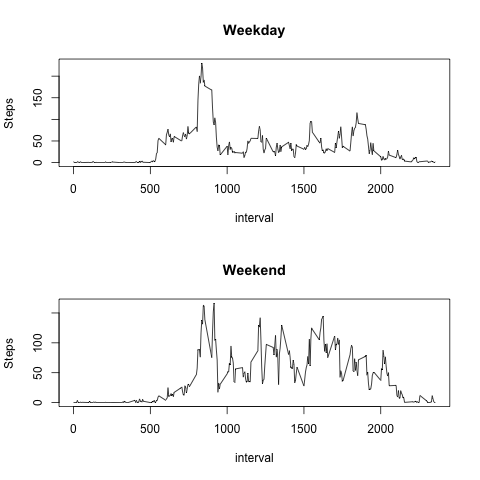

## Loading and preprocessing the data

The following code is used to load the datafile activity.csv. The file activity.csv is obtained from https://d396qusza40orc.cloudfront.net/repdata%2Fdata%2Factivity.zip

activity <- read.csv2("activity.csv", sep=",", na.strings = "NA")

activity$steps <- as.numeric(activity$steps)
activity$interval <- as.numeric(activity$interval)
activity$date <- as.Date(activity$date)

## What is mean total number of steps taken per day?

Mean of total number of steps taken per day is 9354

Please see stepsperday.R for the histogram for  mean & median number of steps taken per day

## What is the average daily activity pattern?

This information is not available in the dataset. if the steps are considered as the activity pattern then 
the average daily activity pattern is same as the mean which is 9354

## Imputing missing values
There are about 2304 records having NA. NA values are replace with the mean for that 5-minute interval.

The following logic is used for imputing the missing values. Please see imputing.R 

activity <- read.csv2("activity.csv", sep=",", na.strings = "NA")
activity$steps <- as.double(activity$steps)
activity$interval <- as.numeric(activity$interval)
activity$date <- as.Date(activity$date)

intervalGroupByActivity <- group_by(activity,  interval)

avgStepsPerInterval <- summarize(intervalGroupByActivity, avg_steps=mean(na.omit(steps)))

avgStepsPerInterval$avg_steps=as.double(avgStepsPerInterval$avg_steps)

naActivity <- activity[is.na(activity$steps)==TRUE,]

naActivity$steps<-lapply(naActivity$interval, function(x) avgStepsPerInterval[avgStepsPerInterval$interval==x,]$avg_steps)

naActivity$steps=as.double(naActivity$steps)

newDataSet <- rbind(activity[is.na(activity$steps)==FALSE,], naActivity)
newDataSet$steps=as.double(newDataSet$steps)

## Are there differences in activity patterns between weekdays and weekends?

There is difference is not steps taken over the weekdays and weekends.

