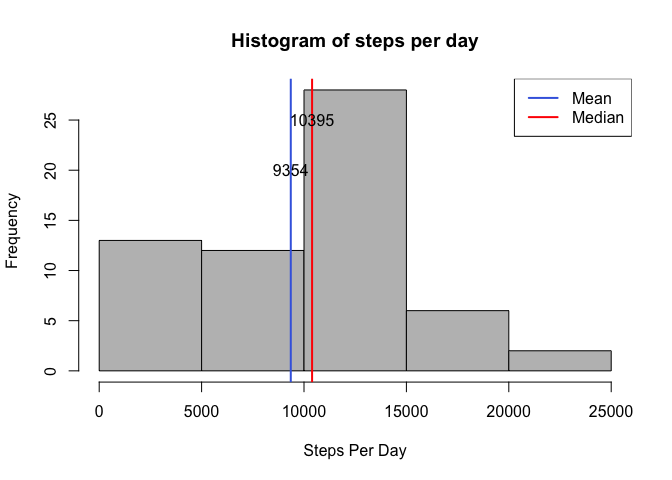
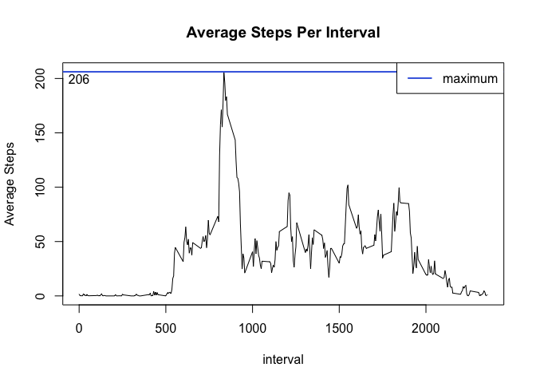
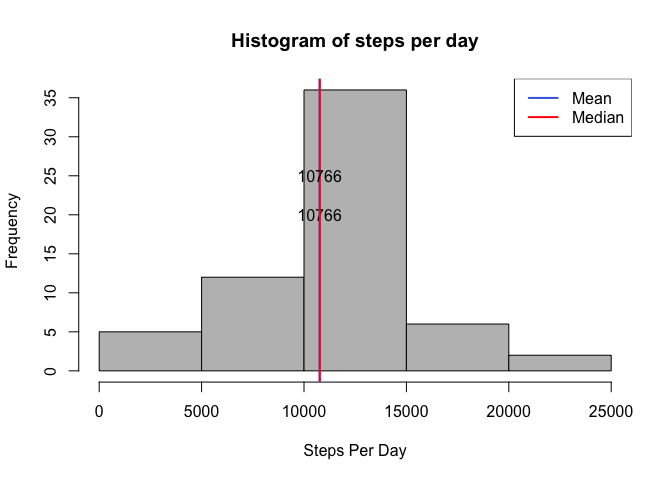
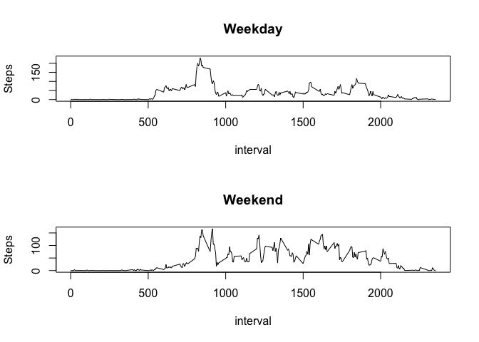

# Reproducible Research: Peer Assessment 1


## Loading and preprocessing the data

Load the extracted activity.csv file for the working directory.


```r
library(dplyr)
```

```
## 
## Attaching package: 'dplyr'
```

```
## The following objects are masked from 'package:stats':
## 
##     filter, lag
```

```
## The following objects are masked from 'package:base':
## 
##     intersect, setdiff, setequal, union
```

```r
activity <- read.csv2("activity.csv", sep=",", na.strings = "NA")
```

Define the data type for the columns read.

```r
activity$steps <- as.numeric(activity$steps)
activity$interval <- as.numeric(activity$interval)
activity$date <- as.Date(activity$date)
```

## What is mean total number of steps taken per day?

Group the data on  date field and summarize the data by omitting NA values.


```r
#group by data
dateGroupByActivity <- group_by(activity,  date)

#calculate the total steps using summarize function
stepsPerDay <- summarize(dateGroupByActivity, total_steps=sum(na.omit(steps)))
```

Plot the histogram and show mean and median.


```r
#show the histor gram
hist(na.omit(stepsPerDay$total_steps), xlab="Steps Per Day", main="Histogram of steps per day", col="grey")

#display the mean
abline(v = mean(na.omit(stepsPerDay$total_steps)), col = "royalblue", lwd = 2)
text(mean(na.omit(stepsPerDay$total_steps)),20, round(mean(na.omit(stepsPerDay$total_steps))))

#display the median
abline(v = median(na.omit(stepsPerDay$total_steps)), col = "red", lwd = 2)
text(median(na.omit(stepsPerDay$total_steps)),25,median(na.omit(stepsPerDay$total_steps)))
legend(x = "topright", c("Mean", "Median"),  col = c( "royalblue", "red"), lwd = c(2, 2))
```

\

the mean value is 

```r
mean(na.omit(stepsPerDay$total_steps))
```

```
## [1] 9354.23
```

the median value is 

```r
median(na.omit(stepsPerDay$total_steps))
```

```
## [1] 10395
```

## What is the average daily activity pattern?

Group the data on interval field. 


```r
#group by interval
intervalGroupByActivity <- group_by(activity,  interval)
```

Call summarize function to calculate average no. of steps.  While summarizing omit the NA values


```r
#calulate avg no. of steps
avgStepsPerInterval <- summarize(intervalGroupByActivity, avg_steps=mean(na.omit(steps)))
avgStepsPerInterval$avg_steps=as.numeric(avgStepsPerInterval$avg_steps)
```

Plot the time series chat

```r
#draw the time series plot
plot(avgStepsPerInterval$interval, avgStepsPerInterval$avg_steps, type="l", xlab="interval", ylab="Average Steps", main="Average Steps Per Interval")

abline(h = max(avgStepsPerInterval$avg_steps), col = "royalblue", lwd = 2)

legend(x = "topright", c("maximum"),  col=c("royalblue"), lwd = c(2) )
text(0,200,round(max(avgStepsPerInterval$avg_steps)))
```

\

The maximum no. of steps taken is 

```r
max(avgStepsPerInterval$avg_steps)
```

```
## [1] 206.1698
```

## Imputing missing values

Calculate and report the total number of missing values in the dataset


```r
sum(is.na(activity$steps))
```

```
## [1] 2304
```

Create new data set by replacing missing values with the mean number of steps for that 5-minute interval


```r
#calculate average no. of steps for the 5 minute interval
intervalGroupByActivity <- group_by(activity,  interval)
avgStepsPerInterval <- summarize(intervalGroupByActivity, avg_steps=mean(na.omit(steps)))
avgStepsPerInterval$avg_steps=as.double(avgStepsPerInterval$avg_steps)

#get data having NA value for steps
naActivity <- activity[is.na(activity$steps)==TRUE,]

#replace missing values with  avg no. of steps for that interval
naActivity$steps<-lapply(naActivity$interval, function(x) avgStepsPerInterval[avgStepsPerInterval$interval==x,]$avg_steps)
naActivity$steps=as.double(naActivity$steps)

## combine the replaced data with orginal data 
newDataSet <- rbind(activity[is.na(activity$steps)==FALSE,], naActivity)
newDataSet$steps=as.double(newDataSet$steps)
```

Plot the histogram of the new data set, show the mean and medion on the chart.


```r
#group by date
dateGroupByActivity <- group_by(newDataSet,  date)

#calculate total steps per date
stepsPerDay <- summarize(dateGroupByActivity, total_steps=sum(as.numeric(steps)))

#drow the histogram
hist(stepsPerDay$total_steps, xlab="Steps Per Day", main="Histogram of steps per day", col="grey")

#display the mean
abline(v = mean(stepsPerDay$total_steps), col = "royalblue", lwd = 2)
text(mean(na.omit(stepsPerDay$total_steps)),20, round(mean(na.omit(stepsPerDay$total_steps))))

#display the median
abline(v = median(stepsPerDay$total_steps), col = "red", lwd = 2)
text(median(na.omit(stepsPerDay$total_steps)),25,round(median(na.omit(stepsPerDay$total_steps))))

#draw the legend
legend(x = "topright", c("Mean", "Median"),  col = c( "royalblue", "red"), lwd = c(2, 2))
```

\

There is change in the mean and median values. Both mean and median increase after replacing the missing values.

The mean value of the new data set is 

```r
mean(na.omit(stepsPerDay$total_steps))
```

```
## [1] 10766.19
```

The median value of the new data set is 

```r
median(na.omit(stepsPerDay$total_steps))
```

```
## [1] 10766.19
```

## Are there differences in activity patterns between weekdays and weekends?

Create a new factor variable in the dataset with two levels – “weekday” and “weekend” indicating whether a given date is a weekday or weekend day.


```r
#defne week days
week_days <- c('Monday', 'Tuesday', 'Wednesday', 'Thursday', 'Friday')

#define the factor variable
newDataSet$dayType  <- factor((weekdays(newDataSet$date) %in% week_days), levels=c(FALSE,TRUE), labels=c('weekend','weekday'))
```

Show the time series plot of the 5-minute interval (x-axis) and the average number of steps taken, averaged across all weekday days or weekend days (y-axis).


```r
#group by day Type and interval
intervalGroupByActivity <- group_by(newDataSet,  dayType, interval)

#calculate the average no. of steps
newSummary <- summarize(intervalGroupByActivity,avg_steps=mean(steps))

#draw the plot
par(mfrow=c(2,1))

weekdaySummary <- newSummary[newSummary$dayType=='weekday',]
weekendSummary <- newSummary[newSummary$dayType=='weekend',]
  
plot(weekdaySummary$interval, weekdaySummary$avg_steps, type="l", xlab="interval", ylab="Steps", main="Weekday")
plot(weekendSummary$interval, weekendSummary$avg_steps, type="l", xlab="interval", ylab="Steps", main="Weekend")
```

\

There is difference in activity patterns between the weekdays and weekends.
